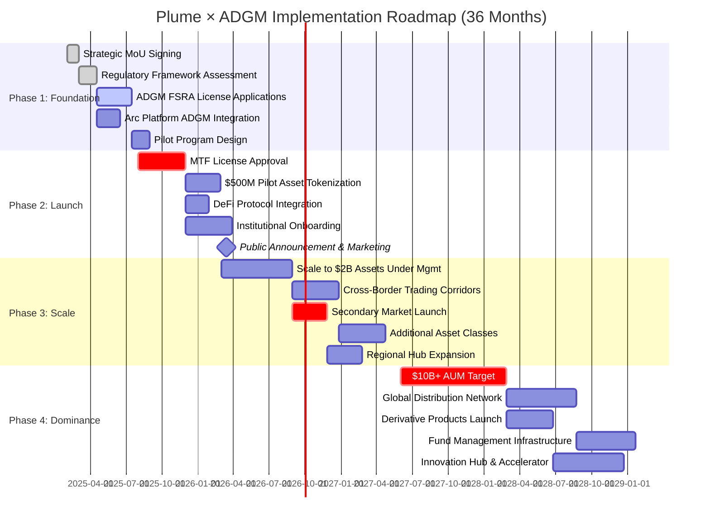
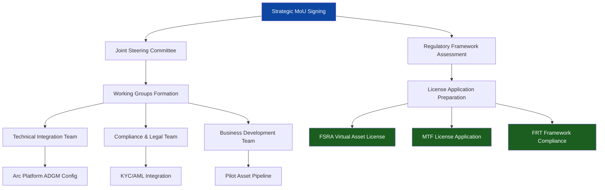
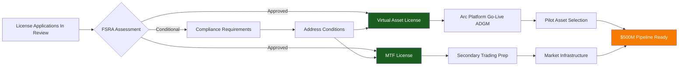
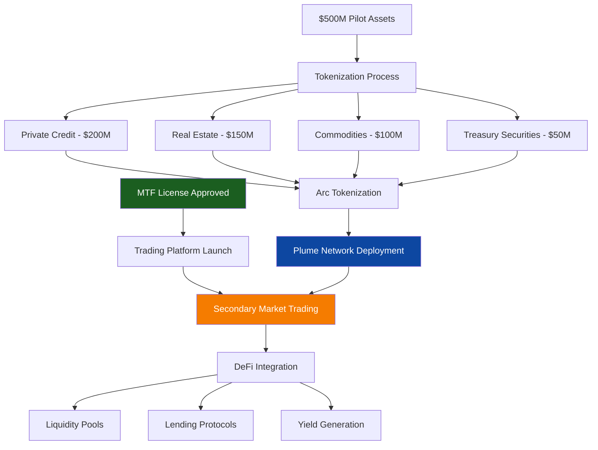
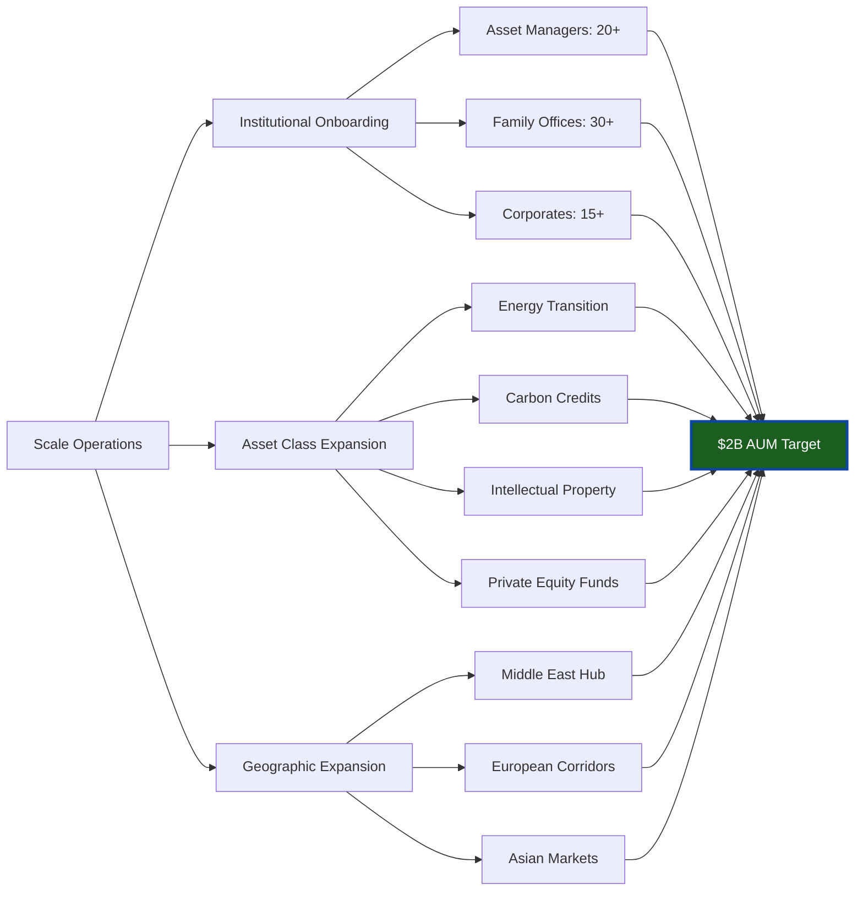
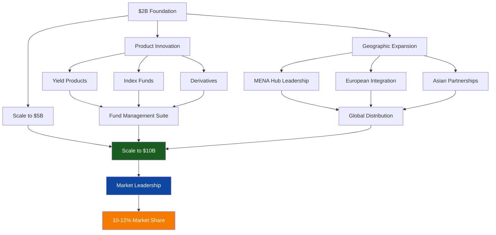
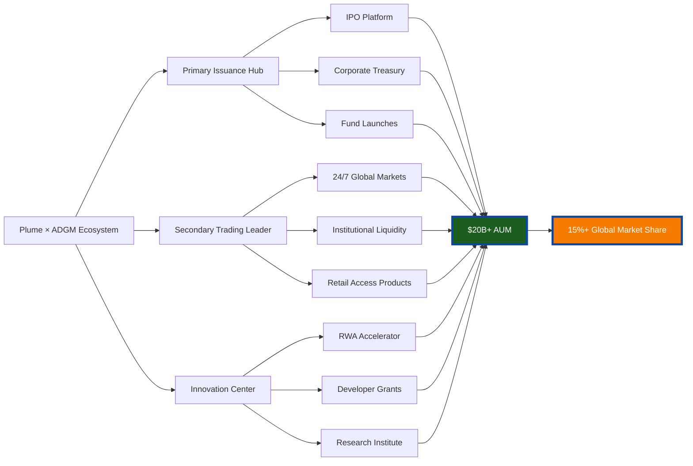
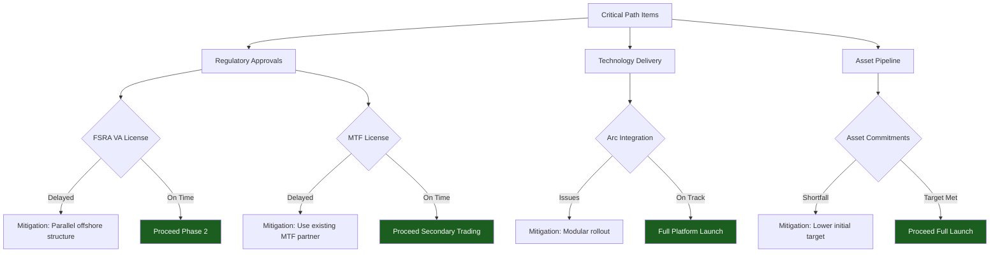

# Implementation Roadmap: Plume Network × ADGM Strategic Partnership

## Timeline Visualization (Mermaid Gantt Chart)

## Phase 1: Foundation Building (Months 1-6)
**Target: Q1-Q2 2025**

### Quarter 1 (Months 1-3)

**Key Milestones:**
- ✓ **Week 1-2**: MoU signing and public announcement
- ✓ **Week 3-4**: Joint steering committee formation (ADGM + Plume leadership)
- ✓ **Week 5-8**: Regulatory framework deep-dive with FSRA
- ✓ **Week 9-12**: License applications submitted

**Deliverables:**
1. Signed Strategic Partnership MoU
2. FSRA Virtual Asset License application (submitted)
3. MTF License application (submitted)
4. Technical integration plan (completed)
5. Pilot program design document (approved)

### Quarter 2 (Months 4-6)

**Key Milestones:**
- ✓ **Month 4**: FSRA Virtual Asset License approval (expected)
- ✓ **Month 5**: Arc platform ADGM deployment complete
- ✓ **Month 6**: Pilot asset pipeline secured ($500M committed)
- ✓ **Month 6**: MTF License approval (expected)

**Deliverables:**
1. FSRA Virtual Asset operating license (approved)
2. Arc tokenization platform ADGM-compliant version (live)
3. Pilot program participants confirmed (3-5 institutional partners)
4. $500M asset pipeline documented and verified
5. Marketing and communications plan (finalized)

---

## Phase 2: Market Launch (Months 7-18)
**Target: Q3 2025 - Q2 2026**

### Quarter 3 2025 (Months 7-9)

**Key Milestones:**
- ✓ **Month 7**: Public launch announcement
- ✓ **Month 8**: First $100M of assets tokenized
- ✓ **Month 9**: Secondary trading volume reaches $50M
- ✓ **Month 9**: 5+ DeFi protocols integrated

**Deliverables:**
1. Public launch event and global PR campaign
2. $500M assets successfully tokenized
3. 100+ institutional investors onboarded
4. Secondary trading platform operational
5. DeFi integration live (Morpho, Curve, Ambient)

### Quarters 4-Q2 2026 (Months 10-18)

**Key Milestones:**
- ✓ **Month 12**: $1B assets under management
- ✓ **Month 15**: 50+ institutional participants
- ✓ **Month 18**: $2B AUM achieved
- ✓ **Month 18**: 10+ asset classes supported

**Deliverables:**
1. $2B in tokenized assets on platform
2. 50+ institutional participants active
3. $500M+ secondary trading volume (cumulative)
4. Cross-border trading corridors established (3+ regions)
5. Regulatory precedents established for new asset classes

---

## Phase 3: Market Leadership (Months 19-30)
**Target: Q3 2026 - Q2 2027**

### Expansion Strategy

**Key Milestones:**
- ✓ **Month 21**: $3B AUM
- ✓ **Month 24**: $5B AUM
- ✓ **Month 27**: $7B AUM
- ✓ **Month 30**: $10B+ AUM achieved

**Deliverables:**
1. $10B+ assets under management
2. 100+ institutional participants
3. $2B+ annual trading volume
4. Nest protocol launch (fund management vaults)
5. ADGM established as #1 RWA tokenization hub globally

---

## Phase 4: Global Dominance (Months 31-36+)
**Target: Q3 2027 onwards**

### Ecosystem Maturity

**Long-Term Vision (36+ months):**
- $20B+ assets under management
- 15%+ global RWA market share
- 200+ institutional participants
- 50+ asset classes supported
- 1M+ wallet holders with RWA exposure
- Global standard-setter for regulated tokenization

---

## Critical Path Analysis

### Dependencies & Risk Mitigation

### Risk Register

| Risk | Impact | Probability | Mitigation |
|------|--------|-------------|------------|
| Regulatory delay | High | Medium | Parallel offshore structure, phased approach |
| Asset pipeline shortfall | Medium | Low | Diversified sources, flexible targets |
| Technical integration issues | Medium | Low | Modular architecture, fallback options |
| Market adoption slower than expected | Medium | Medium | Enhanced incentives, partnerships |
| Competitor acceleration | Medium | Medium | First-mover advantage, regulatory moat |

---

## Success Metrics by Phase

### Phase 1 (Foundation) - Months 1-6
- ✓ Regulatory approvals: 2/2 (VA + MTF licenses)
- ✓ Asset pipeline: $500M committed
- ✓ Technology readiness: 95%+
- ✓ Partnership agreements: 5+ signed

### Phase 2 (Launch) - Months 7-18
- ✓ Assets tokenized: $2B
- ✓ Institutional participants: 50+
- ✓ Trading volume: $500M cumulative
- ✓ DeFi integrations: 10+ protocols

### Phase 3 (Leadership) - Months 19-30
- ✓ Assets under management: $10B
- ✓ Market share: 10-12% of global RWA market
- ✓ Geographic presence: 5+ regions
- ✓ New products launched: 5+ fund/derivative products

### Phase 4 (Dominance) - Months 31-36+
- ✓ Assets under management: $20B+
- ✓ Market share: 15%+ of global RWA market
- ✓ Participants: 200+ institutional
- ✓ Innovation: ADGM as global RWA center

---

## Resource Requirements

### Team Build-Out

**Phase 1 (Months 1-6):** 15-20 FTEs
- Regulatory & Compliance: 4-5
- Technology & Integration: 6-8
- Business Development: 3-4
- Operations: 2-3

**Phase 2 (Months 7-18):** 40-50 FTEs
- Institutional Sales: +10
- Trading & Markets: +8
- Asset Management: +6
- Customer Success: +6

**Phase 3 (Months 19-30):** 80-100 FTEs
- Product Development: +15
- Regional Offices: +20
- Risk & Compliance: +10
- Marketing & Comms: +5

**Phase 4 (Months 31-36+):** 150+ FTEs
- Global expansion teams
- Innovation & R&D
- Strategic partnerships
- Institutional coverage

---

## Investment Timeline

### Capital Requirements by Phase

| Phase | Capital Needed | Primary Use |
|-------|----------------|-------------|
| **Phase 1** | $5-8M | Regulatory, technology setup, pilot program |
| **Phase 2** | $15-25M | Platform scaling, marketing, institutional onboarding |
| **Phase 3** | $30-50M | Geographic expansion, product development, team growth |
| **Phase 4** | $50M+ | Global dominance, M&A, innovation center |
| **Total 36mo** | $100-133M | Full implementation |

### Revenue Projections

| Year | AUM Target | Revenue (Conservative) | Revenue (Target) |
|------|-----------|------------------------|------------------|
| **2025** | $1B | $10-15M | $20-30M |
| **2026** | $5B | $50-75M | $100-150M |
| **2027** | $15B | $150-225M | $300-450M |
| **2030** | $50B+ | $500M-1B | $1-2B |

---

**Document Status:** Implementation Roadmap - Version 1.0
**Last Updated:** January 2025
**Next Review:** Quarterly updates throughout implementation
