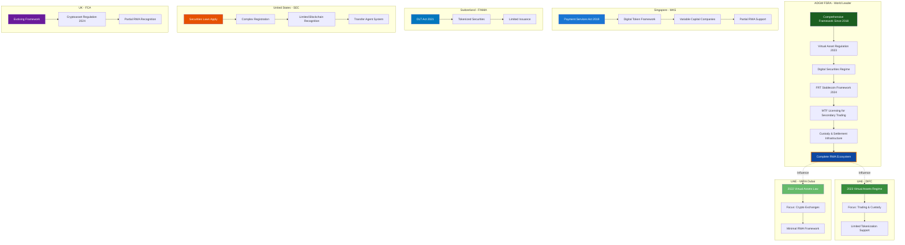
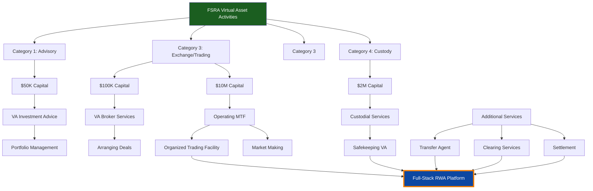
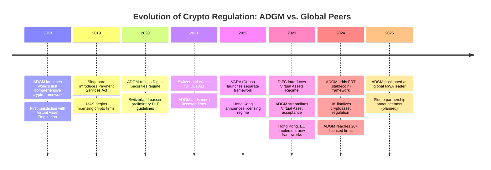
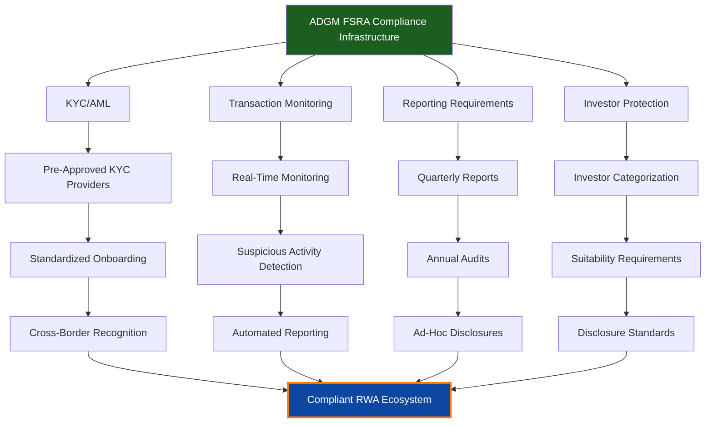
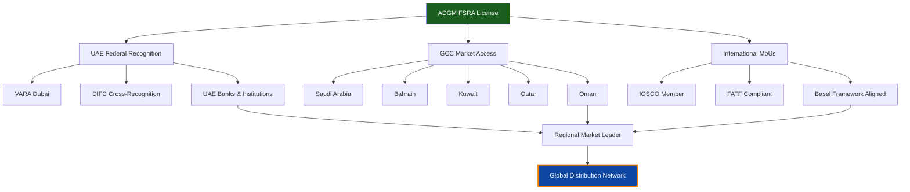
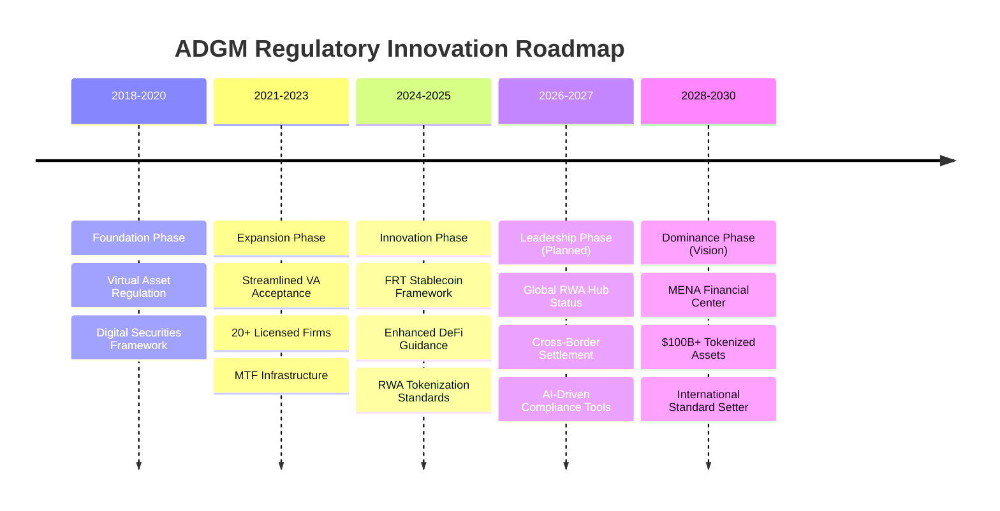
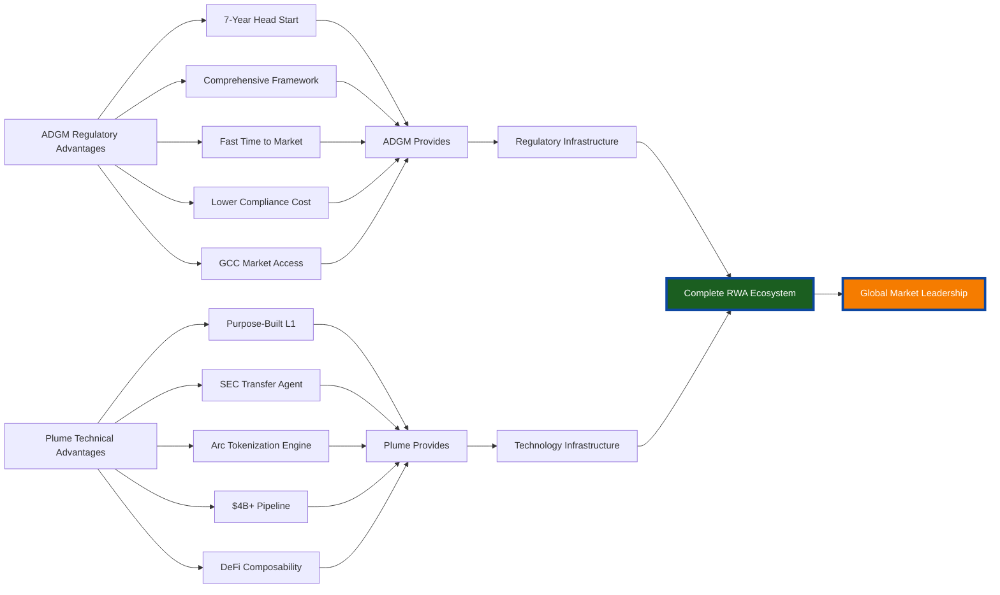

# Regulatory Framework Comparison: ADGM vs. Global Jurisdictions

## ADGM FSRA vs. Global Crypto Regulatory Frameworks

---

## Detailed Comparison Matrix

### Regulatory Maturity & Comprehensiveness

| Jurisdiction | Framework Year | Virtual Assets | Digital Securities | Tokenization | Stablecoins | MTF/ATS | Custody | Score |
|--------------|----------------|----------------|-------------------|--------------|-------------|---------|---------|-------|
| **ADGM (Abu Dhabi)** | 2018 | ✅ Full | ✅ Full | ✅ Full | ✅ Full | ✅ Full | ✅ Full | **10/10** |
| DIFC (Dubai) | 2023 | ✅ Full | ⚠️ Partial | ⚠️ Limited | ❌ None | ⚠️ Partial | ✅ Full | 6/10 |
| VARA (Dubai) | 2022 | ✅ Full | ❌ None | ❌ Minimal | ⚠️ Partial | ❌ None | ✅ Full | 5/10 |
| Singapore (MAS) | 2019 | ✅ Full | ⚠️ Partial | ⚠️ Partial | ✅ Full | ⚠️ Partial | ✅ Full | 7/10 |
| Switzerland (FINMA) | 2021 | ✅ Full | ✅ Full | ⚠️ Limited | ⚠️ Partial | ⚠️ Partial | ✅ Full | 7/10 |
| United States (SEC) | 1933/34 | ⚠️ Partial | ✅ Full | ❌ Limited | ⚠️ Evolving | ✅ Full | ✅ Full | 6/10 |
| United Kingdom (FCA) | 2024 | ⚠️ Evolving | ⚠️ Partial | ❌ Limited | ⚠️ Evolving | ⚠️ Partial | ⚠️ Partial | 4/10 |
| Hong Kong (SFC) | 2023 | ✅ Full | ⚠️ Partial | ❌ Minimal | ⚠️ Partial | ⚠️ Partial | ✅ Full | 6/10 |

**Legend:**
- ✅ Full = Comprehensive regulation with clear pathways
- ⚠️ Partial = Framework exists but gaps remain
- ❌ None/Limited = No framework or extremely restrictive

---

## License Types & Capital Requirements

### ADGM FSRA Licensing Structure

### Comparative Capital Requirements

| Jurisdiction | Exchange License | Custody License | Advisory | Broker-Dealer |
|--------------|-----------------|----------------|----------|---------------|
| **ADGM** | $10M | $2M | $50K | $100K |
| DIFC | $15M | $5M | $100K | $500K |
| VARA (Dubai) | $4.3M | $2.9M | N/A | N/A |
| Singapore | SGD 1.5M (~$1.1M) | SGD 1M (~$740K) | SGD 250K | SGD 500K |
| Switzerland | CHF 1.5M (~$1.7M) | CHF 5M (~$5.6M) | CHF 100K | CHF 1.5M |
| United States | $1M+ (varies) | $1M+ (varies) | Variable | $250K-5M |
| United Kingdom | £5M (~$6.3M) | £2M (~$2.5M) | £100K | £730K |

**ADGM Advantage:** Competitive capital requirements with comprehensive framework coverage

---

## Regulatory Timeline Comparison

**Key Insight:** ADGM has **7-year head start** on comprehensive crypto regulation vs. most global peers

---

## RWA-Specific Framework Comparison

### Tokenization Pathway Clarity

```mermaid
graph LR
    subgraph "ADGM - Clear 3-Step Path"
        A1[1. FSRA Pre-Application] --> A2[2. Token Classification]
        A2 --> A3[3. License Application]
        A3 --> A4[4. Compliant Tokenization]
        A4 --> A5[5. MTF Listing]
        A5 --> A6[6. Secondary Trading]

        style A1 fill:#1B5E20,color:#fff
        style A6 fill:#0D47A1,color:#fff
    end

    subgraph "Singapore - Moderate Complexity"
        S1[1. MAS Consultation] --> S2[2. PSA License]
        S2 --> S3[3. CMS License If Security]
        S3 --> S4[4. VCC Structure]
        S4 --> S5[5. Limited Trading]

        style S1 fill:#1976D2,color:#fff
        style S5 fill:#1976D2,color:#fff
    end

    subgraph "United States - Complex & Fragmented"
        U1[1. SEC No-Action Letter?] --> U2[2. Regulation D/A/CF?]
        U2 --> U3[3. State Blue Sky?]
        U3 --> U4[4. ATS Registration?]
        U4 --> U5[5. Transfer Agent?]
        U5 --> U6[6. FINRA?]
        U6 --> U7[7. Limited Trading]

        style U1 fill:#E65100,color:#fff
        style U7 fill:#E65100,color:#fff
    end

    subgraph "Switzerland - Moderate Path"
        SW1[1. FINMA Guidance] --> SW2[2. DLT Trading Facility]
        SW2 --> SW3[3. Securities Reg]
        SW3 --> SW4[4. Limited Market]

        style SW1 fill:#0277BD,color:#fff
        style SW4 fill:#0277BD,color:#fff
    end
```

### Time to Market: Regulatory Approval Timeline

| Jurisdiction | Initial Consultation | License Approval | Token Issuance | Secondary Trading | **Total Time** |
|--------------|---------------------|------------------|----------------|-------------------|----------------|
| **ADGM** | 2-4 weeks | 3-6 months | 2-4 weeks | Immediate (w/ MTF) | **4-8 months** |
| Singapore | 4-8 weeks | 6-9 months | 4-8 weeks | 3-6 months | **12-18 months** |
| Switzerland | 6-12 weeks | 6-12 months | 4-8 weeks | 6-12 months | **18-24 months** |
| United States | 3-6 months | 12-24 months | 2-6 months | 12-18 months | **24-36+ months** |
| United Kingdom | 8-12 weeks | 9-15 months | 4-8 weeks | 6-12 months | **18-24 months** |

**ADGM Advantage:** 3-6x faster time to market compared to other major jurisdictions

---

## Compliance & KYC Infrastructure

### Built-In Compliance Features

### Compliance Cost Comparison (Annual)

| Jurisdiction | Regulatory Fees | Compliance Staff | External Audits | Tech Infrastructure | **Total Annual Cost** |
|--------------|----------------|------------------|-----------------|---------------------|---------------------|
| **ADGM** | $50-200K | $300-500K | $50-100K | $100-200K | **$500K-1M** |
| Singapore | $100-300K | $400-700K | $100-200K | $150-300K | $750K-1.5M |
| Switzerland | $150-400K | $500-800K | $150-250K | $200-400K | $1M-1.85M |
| United States | $300-800K | $800K-1.5M | $250-500K | $300-600K | $1.65M-3.4M |
| United Kingdom | $200-500K | $600K-1M | $150-300K | $200-400K | $1.15M-2.2M |

**ADGM Advantage:** 40-70% lower compliance costs vs. other major financial centers

---

## Cross-Border Recognition & Passporting

### International Framework Recognition

### Recognized Partnerships & MoUs

| ADGM Recognition | Impact for Plume |
|------------------|------------------|
| **GCC Financial Markets** | Direct access to $2.7T regional economy |
| **IOSCO Membership** | Global regulatory credibility |
| **FATF Compliance** | International banking access |
| **Basel III Aligned** | Institutional acceptance |
| **UK Common Law** | Familiar legal framework for global institutions |

---

## Regulatory Innovation & Future-Readiness

### Progressive Framework Development

### Regulatory Flexibility Score

| Jurisdiction | Amendment Speed | Innovation Support | Industry Engagement | Sandbox Programs | **Flexibility Score** |
|--------------|----------------|-------------------|--------------------|-----------------|--------------------|
| **ADGM** | Fast (6-12mo) | Proactive | High | Yes (RegLab) | **9/10** |
| Singapore | Moderate (12-18mo) | Supportive | High | Yes (FinTech) | 8/10 |
| Switzerland | Slow (18-24mo) | Neutral | Medium | Limited | 6/10 |
| United States | Very Slow (24-36mo+) | Reactive | Low | Limited | 4/10 |
| United Kingdom | Moderate (12-24mo) | Supportive | Medium | Yes (Sandbox) | 7/10 |

---

## Strategic Advantages Summary

### Why ADGM FSRA + Plume = Winning Combination

### Competitive Moat

**No other combination globally offers:**
1. ✅ Purpose-built RWA blockchain (Plume - only one)
2. ✅ SEC Transfer Agent status (Plume - only blockchain)
3. ✅ 7-year mature crypto regulation (ADGM - world's first)
4. ✅ Full tokenization-to-trading infrastructure (ADGM FSRA)
5. ✅ Regional market access (GCC $2.7T economy)
6. ✅ 4-8 month time to market (vs. 18-36 months elsewhere)
7. ✅ 40-70% lower compliance costs
8. ✅ Common law jurisdiction (familiar to global institutions)

---

**Document Status:** Regulatory Framework Comparison - Version 1.0
**Last Updated:** January 2025
**Sources:** ADGM FSRA, MAS, FINMA, SEC, FCA, industry reports
